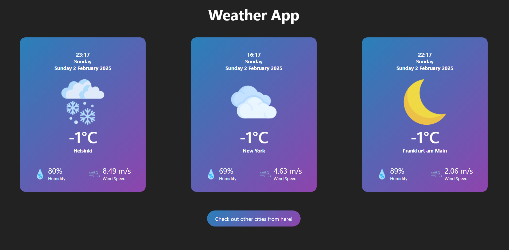

<h1>Weather App</h1>
 
A simple weather application that provides real-time weather information. It uses data from the OpenWeatherMap API and displays weather details with intuitive images to represent different weather conditions.
 
<h2>Features</h2>
- Search by City: Users can search for weather information for any city.
 
- Date and time: Display date, weekday and time.
 
- Current Weather: Displays temperature, humidity, wind speed, and weather condition.
 
- Weather Images: Corresponding images for various weather conditions (clear sky, clouds, rain, snow, etc.).
 
 
The default page shows three of my favourite cities. (Yes, every one of them had the same temperature at the time.)
 

The search page of course has only one city at time.

 
<h2>Technologies Used</h2>
- Frontend: HTML, CSS, JavaScript
 
- Weather API: OpenWeatherMap API
 
- Images: Icons for different weather conditions (e.g., sunny, cloudy, rainy, snowy)
