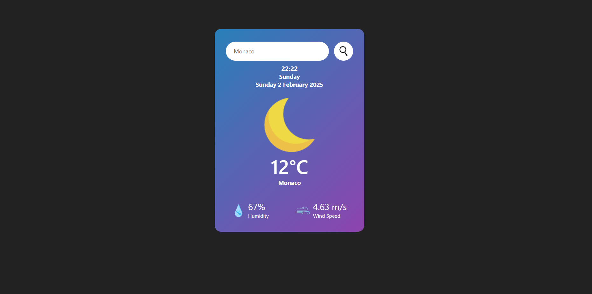

<h1>Weather App</h1>
 
A simple weather application that provides real-time weather information. It uses data from the OpenWeatherMap API and displays weather details with intuitive images to represent different weather conditions.

Features
- Search by City: Users can search for weather information for any city.
- Date and time: Display date, weekday and time.
- Current Weather: Displays temperature, humidity, wind speed, and weather condition.
- Weather Images: Corresponding images for various weather conditions (clear sky, clouds, rain, snow, etc.).

The default page shows three of my favourite cities.

Technologies Used
- Frontend: HTML, CSS, JavaScript
- Weather API: OpenWeatherMap API
- Images: Icons for different weather conditions (e.g., sunny, cloudy, rainy, snowy)
